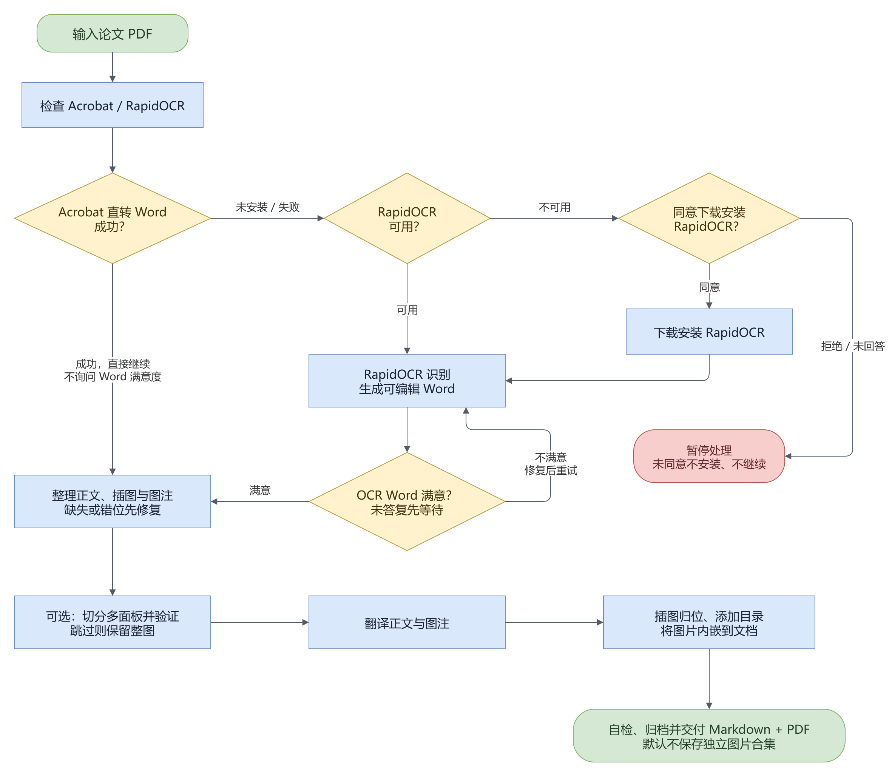

# paper-translator

> 一个 Claude Code Skill：把英文学术论文 PDF 完整翻译成中文——**图和正文一起交付**，同时输出 Markdown 和 PDF。

**English**: A Claude Code skill that translates English academic papers into Chinese. It extracts *figures* as well as text, cross-checks that no figure was silently dropped, and renders the result to both Markdown and PDF — no LaTeX required.

---

## 流程概览



> 2026-09-14 更新：能力自检仅接受 Acrobat Pro 和 RapidOCR；Acrobat 直转 Word 成功后不问满意度，OCR 重建 Word 必须问；不询问保存图片合集，默认不保存独立图集。

蓝色是处理步骤，黄色菱形是分支，绿色是输入与交付，红色是停止或等待。**OCR 重建 Word 的满意度必须由用户确认，Acrobat 成功直转不问满意度。** 任何一处 `exit 3` 没查证就不许往下走。

**`1.0 preflight.py` 是第一条命令**，能力只检查 Acrobat Pro、Skill 本地 RapidOCR。
2026-09-15 起，OCR 程序和依赖固定放在真实 Skill 的 `ocr/.venv`，模型放在 `ocr/models`。
不认可全局 Python 或其他项目内的 OCR。缺失时请求用户同意下载到本 Skill；两条路径都不可用且拒绝或未回答时停止。

主干是：**记录原件位置 → 检查环境 → Acrobat 直转或 RapidOCR 识别 → 核对正文与插图 → 翻译 → 排版与自检 → 将原件 + Markdown + 译文 PDF 归档并核验 → 交付文件夹**。图中只展示主要流程，具体命令见下文及 `SKILL.md`。图片交叉验证与图集保存是不同事项，不保存图集不等于不插图。

**交付位置固定为 `原件最初所在目录 / 文献中文题目 /`**，除非当前用户明确指定其他位置。`D:\codex\outputs` 的通用默认路径不适用于本任务，工作副本的目录也不能替代原件位置。默认将原件移动进去，保持原文件名；另外两份文件命名为 `<原文标题> 中文翻译.md` 和 `<原文标题> 中文翻译.pdf`。`md_to_pdf.py` 只转换、不归档，成功后必须执行 `SKILL.md` 的 6.1 和 7.0，实际核对三件套与路径，才能宣布完成。冲突、续跑和移动失败处理统一以 `SKILL.md` 开头的「交付路径契约」及 6.1 为准。

> 图源文件 [docs/pipeline.drawio](docs/pipeline.drawio)，用 draw.io 打开可改。

---

> ### 🫠 先自曝一下
>
> **这是个纯 vibe coding 产物。** 需求是我提的，坑是我踩的，代码基本是 Claude 写的——我本人是编程小白，看不太懂里面的正则。所以别拿工程规范要求它，能解决问题就行。
>
> **我不维护，也不处理 issue。** 用着不顺手就直接 fork 改成你喜欢的样子，代码 MIT 协议随便改随便发。
>
> 不过该测的都测过了，不是随手生成完就扔上来的：
> - 两篇真实期刊论文全流程跑通（Nature Commun. 24 页、Diamond & Related Materials 8 页双栏）
> - 故意制造漏图场景，确认告警真的会拦下来（而不是个摆设）
> - 矢量图表、正文内嵌图两种边缘场景各自构造 PDF 验证
> - Acrobat 自动导出：两种 layout 模式各导一遍做结构对比；崩溃后恢复注册表的路径单独造场景验证
>
> 开发过程中还测出几个真实 bug 并修掉了：图注被转换器粘进正文时之后所有图编号整体错位一号；「一条图注都没抽到」曾被静默判为通过；Windows 下中文路径与编码引发的多处静默失败。**没测就不敢说能用**——这条底线还是守住了。
>
> 后来又拿两篇真论文（Small 2024 单栏、Adv. Funct. Mater. 2026 十九页双栏综述）跑全流程，当场又抓出两个同类的静默失败，都已修：
> - **`insert_figures.py` 把「零张图」判成成功。** 译文文件名带圆括号（`Small (2024)`）时，`` 的路径匹配到路径里那个 `)` 就停，整行不再算图片行 → 收集到 0 个图块 → 报告为空 → 打印「每张图都归位了」，而六张图一张没动。现在这种情况 exit 3 并指出圆括号
> - **宽横幅 logo 突破了尺寸判据。** 原先只按「远小于中位数」滤页面装饰，而 Wiley 那篇的 `ADVANCED SCIENCE NEWS` 横幅是 2933×676——全篇**最大**的一张图，于是抢走了图 1，后面每张图错位一号。现在加了形状判据：第一条图注之前、长宽比 ≥ 3 的判为装饰（阈值取自 18 张真图实测，最扁的一张是 2.33）

---

> ### 🚨 装完先跑这两行，否则命令要么报「找不到文件」，要么报一串 MISSING
>
> **第一行：`$SK` —— 脚本在哪。** `SKILL.md` 里所有脚本调用统一走 `$SK`，默认值是 `~/.claude/skills/paper-translator`。**前提是 `.py` 真的在那儿。**
>
> ```bash
> SK=~/.claude/skills/paper-translator
> ls "$SK"/*.py >/dev/null 2>&1 || echo "SK 不对：这个目录里没有脚本"
> ```
>
> 打印出提示，说明你的装法把**本体放在了别处**，`~/.claude/skills/paper-translator/` 下只剩一个用来注册 `/paper-translator` 命令的 `SKILL.md`（桩文件）。常见于这几种情况：
>
> - 为了不占系统盘，本体放在别的盘（如 `D:\...\skills\paper-translator`），`~/.claude/skills/` 下只留桩
> - 用 symlink / junction 指过去
> - 走插件方式安装，实际落在 `~/.claude/plugins/` 下
>
> **改法：把 `$SK` 换成真正放着 `.py` 的那个目录**，其余命令一个字都不用动。桩文件正文里通常写明了真实路径。
>
> 桩方案下改了 `description` 要重新生成桩，否则模型读到的还是旧描述——详见下文「触发方式」。
>
> 按下文「安装」直接 `git clone` 到 `~/.claude/skills/paper-translator` 的标准装法不受影响，那行检查会静默通过。
>
> **第二行：`$PY` —— 固定使用 Skill 内的解释器。** Codex 本机的真实目录为
> `D:\skills\paper-translator`，C 盘注册入口不存放脚本或 OCR。
>
> ```powershell
> $SK = 'D:\skills\paper-translator'
> $PY = Join-Path $SK 'ocr\.venv\Scripts\python.exe'
> if (-not (Test-Path -LiteralPath $PY)) { $PY = 'python' }
> & $PY "$SK\preflight.py" --json
> ```
>
> macOS / Linux 使用 `PY="$SK/ocr/.venv/bin/python"`；未安装时仅用系统 Python
> 运行自检或安装器。**不再扫描其他解释器，不把全局已安装等同于本 Skill 已就绪。**
>
> 自检与四个 OCR 命令行入口会自动切换到已存在的本地解释器，其他脚本使用报告中的
> `interpreter`。检查 `probes.ocr.ok` 及 `ocr_root`、`ocr_python`、`ocr_models`；
> 自检退出码 0 可能仅表示 Acrobat 可用。只存在 `ocr/` 空文件夹不能通过自检。

---

> ### ⚠️ 使用前提，务必先读
>
> ---
>
> ## 1. Acrobat Pro、RapidOCR 至少一项可用
>
> ---
>
> **两者都没有就停止，先询问用户是否同意下载、安装 RapidOCR。**
>
> 装完先跑这一行，它会当场告诉你这台机器到底能干什么：
>
> ```bash
> "$PY" preflight.py
> "$PY" preflight.py --json
> ```
>
> 两条路径分别负责：
>
> | 能力 | 有了它 | 没有它 |
> |---|---|---|
> | **Acrobat Pro**（Windows） | 直接将 PDF 转 Word；成功后不问满意度 | 回退 RapidOCR 重建 Word |
> | **[RapidOCR](https://github.com/RapidAI/RapidOCR)** | 识别后重建可编辑 Word，必须询问满意度；还可验证面板标签 | Acrobat 仍可直转，但标签交叉验证需要先补齐 RapidOCR |
>
> **只有本 Skill 内的 RapidOCR 满足 OCR 门禁。** Word 或全局安装均不算；本地 OCR 不可用时，
> 请求用户同意下载或修复 RapidOCR、依赖和模型到 `<真实 Skill 目录>/ocr`。
> 两条路径均不可用且未获得同意时不得安装或继续；没有绕过参数。
>
> **用户明确同意后**，统一使用本地安装器：
>
> ```powershell
> python "$SK\setup_ocr.py" --install
> if ($LASTEXITCODE -ne 0) { throw 'OCR 安装失败' }
> $PY = Join-Path $SK 'ocr\.venv\Scripts\python.exe'
> & $PY "$SK\preflight.py" --json
> ```
>
> 安装器创建隔离环境、安装依赖、复用已有默认模型，并下载缺失模型到 `ocr/models`。
> 不带 `--install` 不安装。自检本身不下载，也不启动 OCR 引擎；它验证本地包来源、
> 依赖导入和默认模型 SHA256。全局安装保留，不会被移动或卸载。
>
> ---
>
> **2. 这是辅助工具，不是质检工具**
>
> 脚本能保证的只有三件事：图没被漏掉、图注没错位、章节没缺失。**翻译质量完全取决于你用的模型**——术语准确性、专业表述、公式转写都可能出错，而且错得很自然，不容易一眼看出来。
>
> OCR 同理：识别率再高也会错，公式、上下标、特殊符号尤其容易出问题。
>
> 学术用途请务必对照原文人工复核，尤其是**数据、单位、结论性表述**。别拿机翻结果直接投稿、引用或转述给他人。

---

## 为什么需要它

### 坑一：图会安静地消失

让 AI 翻译论文 PDF，最常见的失败不是翻错，而是**图没了**。

提取 PDF 文本层是个「安静成功」的操作：零报错、零缺页、正文一字不落，但图一张都不在。你拿到一份读起来通顺、看起来完整的译文，直到发现「如图 3 所示」后面什么都没有。

论文里的图有三种形态，**纯文本提取全都拿不到**：

| 形态 | 为什么会漏 |
|---|---|
| 独立整页图（图注在正文，图在末尾整页） | 该页文字量≈0，但整篇不是扫描件，「扫描件检测」直接放行 |
| 正文页内嵌图 | 该页文字量正常，从任何指标都看不出异常 |
| 矢量绘制的图表 | `get_images()` 返回 0 张，栅格图检测完全失效 |

这个 skill 三种都检测，并做**图数量交叉校验**：正文引用了 Fig. 1–4，就必须产出 4 张图；对不上直接以退出码 3 中止，拒绝在漏图状态下开始翻译。

> 本项目的起因是一次真实事故：一篇 24 页的期刊论文，正文 20 页有文本层，图 1–4 单独占最后 4 页。文本提取一切正常，译文交付了，图一张没有。

### 坑二：傻福外刊非要把一页劈成左右两半 😠

先把结论摆这儿：**双栏是一坨纯粹的历史包袱，一个除了排版惯例自己、谁都不受益的祖宗仪式。**

它当年不是没道理——铅字时代行短一点眼睛少跑、双面印省纸、订起来薄。问题是那套前提早死透了：几乎没人再从图书馆抱纸质合订本回来，绝大多数人是在 13 寸笔记本或 iPad 上看 PDF。可这帮外刊一条都不肯松手，硬把一份为「纸」设计的版式，塞给一个没人打印的世界。

于是流程变成这样：作者交动辄四位数美元的版面费，照它的模板一格一格排整齐，读者最后拿到的是什么？一份缩到整页可见就一个字看不清、放大到能看清一栏就得横向来回拖、读完左栏还得滚回页顶重来一遍的 PDF。**一页要翻两趟。** 就为了供着那条谁也不敢动的中缝。现在很多刊确实也给 HTML 版，但能离线存下来、能标注、能拖进阅读器的，往往还是那份双栏 PDF——所以这份包袱谁也躲不开。😤

它的格式洁癖全花在中缝对不对得齐上，从来没花在「这东西能不能被读」上。**被伺候的是一台早就不在场的印刷机，被牺牲的是每一个活人读者。**

对机器更是灾难，而这里才是真正离谱的地方：**PDF 里根本没有「栏」这个东西。** 文件里只有一堆带坐标的字符，「哪些字属于左栏」全靠转换器按 x 坐标现场猜。人眼看着天经地义的那条中缝，在文件里压根儿不存在。猜错了还不会报错——它只会安静地把两栏交叉拼起来递给你：

| 你以为 | 实际可能发生 |
|---|---|
| 读完左栏再读右栏 | 左栏一行 + 右栏一行交替拼接，句子互相嵌套 |
| 段落是完整的 | 段落断在句子中间（实测某篇双栏论文约 **20%**） |
| 词不会被切开 | `ScienceDirec` 和 `t` 成了两个独立文本框 |
| 一段就是一段 | 双栏正文被打散进 **58 个文本框** |

后三行是此前 PDF 导入实验在单篇论文上的实测数字，换论文、换转换器会变，但**方向是一致的**。Acrobat 的「Retain Page Layout」模式同样中招：它忠实还原视觉位置，代价是句子顺序跨块错乱，实测同一句被搅成过这样：

```
weakly allowed due to ┆ transitions22,23. Notably, ┆ orbital angular momentum mixing
```

扫描件更是重灾区：OCR 按整行横扫，一行同时压到左右两栏时，左栏的半句和右栏的半句**可能**被读成同一句。这一层本项目不解决——OCR 返回什么顺序就是什么顺序。

这些错法有个共同点，也是最阴的地方：**它们在 Markdown 里肉眼全都正常。** 词被切开、两栏拼错、段落断在句中，喂给翻译模型后**可能**产出语法通顺、排版体面、读起来很像样的错译——你不逐句对着原文看，根本抓不出来。一个为了「看起来专业」而存在的排版，最后的产物是看起来专业的胡话，挺配的。所以本项目宁可在翻译开始之前 exit 3 直接罢工，也不生产这种东西。

**所以这个 skill 的输出是单栏的。** 一栏到底、图嵌在正文原位、图注老老实实跟在图下面、「如图 3 所示」下一屏就是图 3——就是毕设论文那个排版，人能一路读下去的那种。想在手机上读、想丢进 Word 接着改、想直接打印，都行。中缝没了，没人会怀念它。

---

## 首选路径（2.0）：先把 PDF 转成 Word

**这是默认第一步。** 优先使用 Acrobat 直接将 PDF 转为 Word，尽量保留图文位置；不可用或转换失败时，只用 RapidOCR 识别并重建 Word。OCR 结果需要用户确认，之后从原 PDF 补齐插图。

> Word 文档只是脚手架，**不是交付物**。最终输出 Markdown + PDF；图片先放在任务工作目录，5.4 内嵌进 Markdown。**不询问是否保存图片合集，默认不保存、不交付独立图集。**

**Acrobat Pro 导出是全自动的**，质量也最好。唯一的人工动作是**首次运行批准一次 UAC**（把受信任脚本写进 Acrobat 安装目录），批准后永久生效，之后零交互：

```powershell
& $PY pdf_to_docx.py <pdf> -o <work>/source.docx  # Acrobat -> RapidOCR
& $PY pdf_to_docx.py --check                # 看本机准备好了没
& $PY pdf_to_docx.py --install-acrobat-js   # 单独装受信任脚本
```

**导出用「Retain Flowing Text」，不是「Retain Page Layout」**（脚本默认已是前者，`--layout page` 可切换）。这跟直觉相反：Page Layout 把每块按视觉位置钉死，正文被打散成上百个文本框、每段写两遍（DrawingML + VML），**句子顺序还跨块错乱**——实测同一句变成「weakly allowed due to ┆ transitions22,23. Notably, ┆ orbital angular momentum mixing」，拿这种输入去翻译很可能出错。Flowing Text 保住阅读顺序、标题层级和分段，图依然嵌在正文原位。

**自动化怎么打通的**：这条路此前被判定为不可能，实际是三个独立故障共用了同一句误导性的 COM 报错「尚未实现」(E_NOTIMPL)：

| 坑 | 症状 | 处理 |
|---|---|---|
| pywin32 调用约定 | **任何** JSObject 方法都报 E_NOTIMPL，连非特权的 `getPageNumWords()` 都报 | 用纯 `DISPATCH_METHOD` 调用（pywin32 默认会附加 `DISPATCH_PROPERTYGET`，Acrobat 拒绝这个组合） |
| folder 脚本位置 | 脚本装了却调不到 | Acrobat 25.x 只读**应用级** `<安装目录>\Javascripts\`，用户级 `%APPDATA%` 那个完全忽略；写应用级要提权，故走一次 UAC |
| Protected Mode | `saveAs` **静默挂死**——不报错、不超时、无对话框 | 导出期间临时关沙箱，结束后写回原值 |

第一条最误导：它看着像特权拒绝，其实与权限模型无关。

> ⚠️ **它会改注册表**：导出期间把 `HKCU\...\Adobe Acrobat\DC\Privileged\bProtectedMode` 置 0，结束后写回；原值同时落盘到临时文件，进程被强杀也能在下次运行时补恢复。不想让它碰沙箱设置就用 `--engine rapidocr`。
>
> **不要以管理员身份运行 Acrobat 或本脚本**——只有那一次文件复制需要提权，提权进程与普通进程之间的 COM 连接会被 Windows 完整性级别隔离挡掉。

实测环境：Acrobat Pro 25.1（Exchange-Pro）+ pywin32 311 + Windows 11。用户拒绝 UAC、没装 Acrobat Pro（Reader 不行）、或不在 Windows 上时，默认回退 RapidOCR；缺少 RapidOCR 时停止并请求安装同意。

**转换引擎只有 Acrobat 和 RapidOCR，不调用 Microsoft Word。** Word/DOCX 只是中间文件格式。RapidOCR 重建结果包含可编辑识别文本与内嵌原页预览，方便用户核对；不宣称恢复了原文版式，也不把整页预览当作论文插图来配号。

### 决策点（2.2）：按实际来源决定是否询问

转换成功后读取同名 `.conversion.json` 的 `engine` 和 `requires_word_review`，不能仅根据“机器装有 Acrobat”判断。

| 实际结果 | 走哪条路 |
|---|---|
| **Acrobat 直转成功** | 不问 Word 满意度；自动检查图文后直接继续，遇到告警自行修复并复测 |
| **RapidOCR 重建 Word** | 展示 Word、识别片段和统计，必须询问满意度并等待回答 |
| **OCR Word 满意** | 使用已认可正文，3.0 从原 PDF 补齐插图后继续 |
| **OCR Word 不满意** | 调整识别或修复结果，重新生成 Word 并再次询问；不得跳过确认 |

有多面板图时，图片交叉验证仍单独征询用户选择。Acrobat 路径只问这一项，不附带满意度问题。任何路径都不询问保存图集。

---

## 依赖

装完先跑 `"$PY" preflight.py`，它会把下面这张表在你机器上的实际状态打出来，并拦下跑不动的组合。

| 用途 | 依赖 | 安装 | 必需性 |
|---|---|---|---|
| PDF 解析与渲染 | PyMuPDF | `"$PY" -m pip install pymupdf` | **硬性**，没有它什么都读不了 |
| 读 Word 文档（首选路径） | lxml | `"$PY" -m pip install lxml` | 走 Word 路径必需 |
| OCR 重建 Word | python-docx | `"$PY" -m pip install python-docx` | RapidOCR 路径必需 |
| OCR 重建与面板切分 | Pillow + NumPy | `"$PY" -m pip install pillow numpy` | RapidOCR 重建或图片交叉验证需要 |
| Acrobat Pro 转换（Windows） | Acrobat Pro + pywin32 | `"$PY" -m pip install pywin32`（Acrobat 需另行安装授权） | **两条能力路径之一** |
| 扫描件 OCR / 面板标签校验 | **[RapidOCR](https://github.com/RapidAI/RapidOCR)** 及运行依赖 | 见前文安装命令 | **两条能力路径之一** |
| Markdown → HTML | pandoc ≥ 3.0 | [pandoc.org/installing](https://pandoc.org/installing.html) | 只影响 PDF 输出 |
| HTML → PDF | Chrome 或 Edge | 大多数系统已自带 | 只影响 PDF 输出 |

两条能力路径至少一条可用，否则 `preflight.py` exit 4。必须先征得用户同意安装 RapidOCR，未同意则停止；文字版 PDF 也不能绕过。

**OCR 只使用本 Skill 内的 [RapidOCR](https://github.com/RapidAI/RapidOCR)。**

- 扫描页重建、正文识别、面板标签校验和诊断命令都只调用 RapidOCR，
  没有其他引擎的自动切换或兼容入口。
- 默认模型为 ONNX 格式的 PP-OCRv6 small 检测、识别模型及方向分类模型，
  保存在 `ocr/models`；自检验证本地依赖来源及三个模型的 SHA256。
- 先征得用户同意，再运行 `setup_ocr.py --install`。依赖安装到 `ocr/.venv`，
  不修改全局 Python；本地环境只安装一种 OpenCV。
- RapidOCR 缺失、损坏或初始化失败时停止 OCR，报告本地修复命令。
  不能改用其他环境继续；诊断命令初始化失败时返回非零退出码。
- 提取扫描件时加 `--ocr`，识别来源记录为 `ocr_backend=RapidOCR`。
  图片诊断：`"$PY" "$SK/ocr_engine.py" <图片>`。
- 已验证版本：`rapidocr 3.9.2` + `onnxruntime 1.26.0` + Python 3.13。

**不需要 LaTeX**。只翻译、不导出 PDF 的话，pandoc 和浏览器可以不装。

---

## 安装

Skill 目录结构与仓库根目录一致，直接 clone 到 skills 目录即可：

**macOS / Linux**

```bash
git clone https://github.com/obenic/paper-translator.git \
  ~/.claude/skills/paper-translator

SK=~/.claude/skills/paper-translator
# 必须先取得用户下载并安装 OCR 的同意：
python3 "$SK/setup_ocr.py" --install || exit 1
PY="$SK/ocr/.venv/bin/python"
"$PY" "$SK/preflight.py" --json
```

**Windows (PowerShell)**

```powershell
$SK = 'D:\skills\paper-translator'  # 放着脚本的真实目录，不是 Slash 注册入口
Get-Item -LiteralPath "$SK\setup_ocr.py"
# 先征得用户同意下载到此 Skill，再执行：
python "$SK\setup_ocr.py" --install
if ($LASTEXITCODE -ne 0) { throw 'OCR 安装失败' }
$PY = Join-Path $SK 'ocr\.venv\Scripts\python.exe'
& $PY "$SK\preflight.py" --json
```

装在 `~/.claude/skills/` 下是**全局生效**（任何目录都能用）；只想在某个项目里用就放到该项目的 `.claude/skills/` 下——**这种装法要按顶部警告把 `$SK` 改成该项目里的实际路径**。

**最后那行 `preflight.py` 不要省。** 确认 `probes.ocr.ok=true`，且报告的解释器、
程序和模型路径全部在真实 Skill 内。`ocr/` 不纳入 Git；更新脚本不会上传本机依赖或权重。
换机器或移动 Skill 后需重建虚拟环境，不能直接把虚拟环境当便携软件复制使用。

装好后新开一个 Claude Code 会话，说「翻译这篇文献」即可。

---

## 使用

把 PDF 路径告诉 Claude 就行：

```
翻译桌面上的 example-paper.pdf
```

流程：**1.0 环境自检** → 2.0 转 Word → 2.1 提取或预览 → **2.2 Acrobat 直转不问满意度，OCR 重建必须问；多面板图另选交叉验证** → 3.0/4.0 → 5.0 分批翻译 → 5.1 写 Markdown → 5.2 图归位 → 5.3 加目录 → 5.4 图片内嵌 → 6.0 转 PDF → 6.1 归档 → 7.0 自检。默认不保存独立图集。

产物收在原 PDF 旁边一个以中文题目命名的文件夹里，原件一起移进去（6.1）：

```
<原 PDF 所在目录>\<中文题目>\
├── <原文文件名>.pdf          # 原件，移动进来，外面不再留
├── <原文标题> 中文翻译.md      # 图片已内嵌；开头带一个可刷新的「目录」块
└── <原文标题> 中文翻译.pdf     # 图片已内嵌，可单独发送；标题页下方是目录页，侧边栏有书签树
```

不放图集：图已经在 md 和 PDF 里、且在原文对应的位置。转换生成的 `.docx`、`_docx/`、`media/`、`panels/`、`_figs/`、`.bak` 等脚手架不进交付文件夹，归档确认后按 `SKILL.md` 6.1 的清理规则处理；用户提供的 `.docx` 原件必须保留并归档，不能当脚手架删除。

### 翻译规范

- 全文翻译，不跳段（摘要、引言、结果、讨论、方法、作者贡献、**图注**）
- **参考文献、致谢、CRediT、利益冲突声明保留英文原文**，不翻译
- **图注要翻译**——复杂图的图注能有几百字，是读懂图的唯一入口
- 图注里的面板标记（**a** / **(a)**）与图号原样保留，只译描述文字
- **图片本体不动**：图里的英文标注保持原样，不做 OCR 重排
- 术语首次出现附原文：系间窜越（intersystem crossing, ISC）
- 化学式、单位、数值、公式编号、图表编号原样保留
- 公式用 Unicode 符号书写，不用 LaTeX
- 人名、期刊名、仪器型号保留英文

---

## 触发方式

Skill 由模型读 `description` 判断是否调用，`description` 里已经写进了具体触发短语，覆盖「翻译 / 译成 / 译为 / 翻成 / 中译 / translate」×「文献 / 论文 / 期刊 / 全文 / 摘要 / PDF / paper / article / literature / manuscript」这些说法：

| 会触发 | 不会触发 |
|---|---|
| 翻译这篇文献 | 翻译这段代码注释 |
| 把这个 PDF 翻译成中文 | 这篇 paper 讲了什么 |
| translate this paper | 总结一下这篇论文 |
| 把期刊全文译为中文 | 把变量名翻译成英文 |

> 改了 `description` 之后，用桩方案的话记得重新生成桩，否则模型看到的还是旧描述。

---

## 脚本说明

九个脚本都可以脱离 Claude 单独当命令行工具用。

### `preflight.py` — 环境自检（1.0，第一个跑的）

```bash
"$PY" preflight.py                 # 报告 + 判定
"$PY" preflight.py --json          # 机器可读
```

能力只检测 Acrobat Pro 和 RapidOCR；另查 PyMuPDF、lxml、python-docx、Pillow、NumPy、pandoc、Chrome/Edge 等依赖，并打印**当前解释器路径**。不启动应用、不安装软件；实际导出与 OCR 是否成功仍由后续命令验证。

| 退出码 | 含义 |
|---|---|
| `0` | Acrobat Pro 或 RapidOCR 至少一项可用 |
| `1` | PyMuPDF 缺失，什么都读不了 |
| `4` | **两条路径均不可用**；必须请求用户同意安装 RapidOCR，未同意则停止 |

判定里有一条不那么显然：**转换器装了但没有 lxml，不算可用能力**——`docx_extract.py` 靠 lxml 解析导出的 .docx，少了它 Word 路径会在下一步死掉。这种情况报告里照实显示 `ok`，但 verdict 里标 `UNUSABLE`。

### `pdf_to_docx.py` — PDF 转 Word（2.0，首选路径）

```bash
"$PY" pdf_to_docx.py <pdf> [-o out.docx] [--engine auto|acrobat|rapidocr]
                           [--layout flowing|page]
"$PY" pdf_to_docx.py --check                 # 看本机准备好了没
"$PY" pdf_to_docx.py --install-acrobat-js    # 一次性安装 Acrobat 受信任脚本
```

`--engine auto` 先试 Acrobat，失败只回退 RapidOCR。Acrobat 默认 `--layout flowing`；RapidOCR 可用 `--ocr-lang`、`--dpi` 调整识别。Acrobat 引擎仅 Windows 可用；RapidOCR 不依赖 COM。成功后写同名 `.conversion.json`，记录实际引擎和满意度确认要求；输出已存在则拒绝覆盖。

Acrobat COM 导出使用独立进程，默认 180 秒超时，可通过 `--acrobat-timeout` 调整。超时后仅清理本次新建的 Acrobat 进程，恢复保护模式，再回退 RapidOCR；接口返回 `ok` 但输出未落盘或 DOCX 无效也按失败处理。

| 退出码 | 含义 |
|---|---|
| `0` | DOCX 结构校验通过，转换来源报告已写出 |
| `2` | 所选转换器均失败；修复能力后重试，不得跳过门禁 |
| `1` | 出错 |

### `docx_extract.py` — 从 Word 抽正文 + 图 + 图的位置（2.1）

```bash
"$PY" docx_extract.py <docx> [-o OUTDIR]
```

产出 `content.md`（正文按顺序，图的位置用 `[[FIG 2 -> media/fig02.jpg]]` 标出）、`content.json`、`media/`（图片按图号命名）、`manifest.json`。

自动处理掉四个坑：

| 坑 | 处理 |
|---|---|
| 每段文字出现两遍 | Word 把文本框同时写成 DrawingML 和 VML 两份，跳过 `mc:Fallback` 子树 |
| 出版商 logo 被当成图 1、图 2，真图全体错位 | 两条判据一起用：**尺寸**滤小徽标（Elsevier logo 只有 248×271，真图 ≥ 950），**形状**滤第一条图注之前长宽比 ≥ 3 的宽横幅。第二条必需——实测 Wiley 那张 `ADVANCED SCIENCE NEWS` 横幅 2933×676 是全篇最大的图，尺寸判据挡不住 |
| 图和它自己的图注在 XML 里离得很远 | Word 把浮动图锚在附近任意一段上，所以**按顺序配对**图与图注，不按距离 |
| 某张图的图注被粘在正文段落尾部 | 该图号从图注清单消失，按清单配号会让**之后所有图整体错位一号**（图 4 的图片被写成 fig05，配上图 5 的图注）。图注数与图数不等时，改用正文引用到的图号列表配号 |
| 作者行、`Keywords:`、DOI、公式碎片被当成章节标题 | 标题读 DOCX 的 `Heading1..9` 样式，不靠「短且不以句号结尾」猜。实测一篇 7 页 Elsevier 论文：靠猜得到 22 个标题（其中 12 个是垃圾，包括一句被截断的正文和四段公式碎片），靠样式得到 9 个，正好是真章节。整篇没有任何标题样式时才退回长度猜 |

对图做**三方交叉校验**——图注、图片、正文引用必须互相对得上，任何一条不符 exit 3：一张图注都没抽到（曾被静默判为通过）、有图注配不到图、正文引用的图号没有图注覆盖。

**exit 3 不等于编号错了。** 图注被粘进正文那种情况，编号已按正文引用自动修正，但那条图注的文字仍散在正文段落里，要自己拼回来再翻译。`manifest.json` 的 `problems` 数组说明具体是哪一条不符。

参考文献 / 致谢 / 声明类章节会自动标 `<!-- 不翻译 -->`。

### `panel_split.py` — 可选：把整张图切成 a/b/c 单个面板并验证（4.0）

```bash
"$PY" panel_split.py <figure.png> -o panels/ --layout 4,3,4,3,1 [--expect a-o]
"$PY" panel_split.py <figure.png> -o panels/ --grid 2x2      # 强制均匀网格
"$PY" panel_split.py <figure.png> -o panels/ --no-ocr        # 只用几何校验
```

**只有用户在 2.2 选择交叉验证时才执行 4.0。** 如果用户跳过，保留整张图，不生成 `panels/`，并把整图放到正文第一次提及处。`--layout` 是每行几个面板，必须自己看图数出来。不给也能跑（自动模式），但经常数错——数错时脚本 exit 3 明说，不会假装成功。面板行间距可以只有 4 px，而面板*内部*（图和刻度标签之间）的空白能有 30 px，纯靠像素分不出哪条是边界。

**`--expect` 建议默认带上**：图注列出的面板字母（`a-o` 或 `a,b,c`）就在抽出来的正文里，抄一遍就多一重校验。

RapidOCR 只做标签校验和命名，不做切分；切分结合布局、几何规则和图注清单。任何检查不过就 exit 3；图注清单校验需要传 `--expect`：

| 校验 | 抓的是什么 | 何时生效 |
|---|---|---|
| 标签一致性 | OCR 读到的 `a`/`b`/`c` 必须落在按阅读顺序命名为同名的那张图里 | 总是（除 `--no-ocr`） |
| 边框留白 | 每张图四周必须是背景色，有墨压边 = 内容被切断 | 总是 |
| 墨量守恒 | 所有面板加起来要覆盖整图 ~100% 的墨，少了 = 丢了色标/图例 | 总是 |
| 文字守恒 | 每个 OCR 文本框的**墨**都要落进某张面板。问的是墨不是矩形——检测框带留白，而面板标签和坐标轴标题天生就贴在裁剪边上，用矩形判会在 4 张真实图上误报 7 次（每一次的墨都 100% 在某张面板内） | 总是（除 `--no-ocr`） |
| 图注清单 | 图注声称的面板数必须等于切出的张数——**唯一不依赖图像本身的证人**，前四重都在看同一张图 | 仅传了 `--expect` 时 |
| 上一面板的文字 | 某张裁剪框里出现了位于**它自己标签上方**的文字。面板在左上角标号，自己的东西不可能跑到标签之上——那是上一行的坐标轴标题被留在了这里 | 总是（除 `--no-ocr`） |

OCR 读不出 `i`、`l`、`o` 是常态（细笔画），脚本会在 note 里说明，并靠其余标签的一致性给它们背书——这不算失败。

没有 RapidOCR 时，`--no-ocr` 只能做几何/墨量辅助检查，不能称为“图片交叉验证”。

### `insert_figures.py` — 把图移到正文第一次提到它的位置（5.2）

```bash
"$PY" insert_figures.py <译文.md> [--dry-run] [-o out.md]
```

图全堆在文末的 `## 图` 里，读者在第 4 页读到「如图 2 所示」要翻到第 12 页再翻回来。脚本把图块整块抬出来，插到第一次提到该图号的正文段落之后，并核对前后图片数量，不一致就拒绝写入。原文件留 `.bak`。

「补充图 2」不算提到图 2，会跳过。提及句后面紧跟公式代码块时，图插到**公式之后**——一段以「按下式估计：」收尾的话和它下面的公式是一个整体，中间塞图会让正文承诺公式却给出曲线。退出码 `3` = 有图在正文里根本找不到提及，必须去查。

**临时译文路径不要带圆括号。** 5.2 仍需解析图片路径来识别图号，所以 `Small (2024)` 应写成 `Small 2024`；5.4 成功后最终 Markdown 会改成 `data:` 图片，不再依赖这个路径。

> 走 Word 首选路径时，图的位置已经由 `docx_extract.py` 给出（比「首次提及」更准），这一步可以跳过；它主要服务于 `extract_paper.py` 回退路径。

### `extract_paper.py` — 提取文本 + 图（3.0，回退路径）

```bash
"$PY" extract_paper.py <pdf> [-o OUTDIR] [--dpi 200] [--max-width 1600] [--pages 21-24] [--ocr] [--ocr-lang en] [--split-panels]
```

产出 `text.txt`、`figures/pNN.png`、`manifest.json`。

**参数说明：**

| 参数 | 作用 |
|---|---|
| `--ocr` | 扫描件用 [RapidOCR](https://github.com/RapidAI/RapidOCR) 提取文字。文字型 PDF 会自动忽略此参数 |
| `--ocr-lang en` | OCR 语种：`en` / `ch`（中英混排）/ `japan` / `korean` 等，默认 `en` |
| `--pages 21-24` | 强制渲染指定页面（图数量告警时用） |
| `--dpi 200` | 渲染分辨率，扫描件识别率低时改 `300` |
| `--max-width 1600` | 限制图片宽度（默认 1600px，控制文件大小） |

| 退出码 | 含义 |
|---|---|
| `0` | 图数量与正文引用一致 |
| `3` | **图可能漏了** — 查 `manifest.json` 的 `per_page`，用 `--pages` 强制渲染 |
| `1` | 出错（例如缺 PyMuPDF、缺 RapidOCR 或 OCR 没有识别出文本） |
| `4` | 扫描件未启用 OCR，确认 RapidOCR 可用后加 `--ocr` 重跑 |

输出示例：

```
pages       : 24  (text pages: 20)
figures     : 4 rendered -> ./figures
  p 21  figures/p21.png     1600x1533   787KB  (standalone figure page; raster image 98% of page)
  p 22  figures/p22.png     1600x1535  1192KB  (standalone figure page; raster image 93% of page)
  p 23  figures/p23.png     1600x1357  1620KB  (standalone figure page; raster image 98% of page)
  p 24  figures/p24.png     1600x1891  1988KB  (standalone figure page; raster image 94% of page)
referenced  : Fig [1, 2, 3, 4]
```

**扫描件示例（加 `--ocr`）：**

```
OCR: scanned PDF, reading 1 pages (lang=en; first run downloads models)...
  p  1: 336 chars
pages       : 1  (text pages: 1)
OCR         : RapidOCR (lang=en)
figures     : 1 rendered -> ./figures
referenced  : Fig [1]

OK: figure count consistent with text references.
```

注意最后两行：OCR 出文字之后，**图数量交叉校验对扫描件也重新生效了**——没有文本层时这个校验是做不了的。

### `add_toc.py` — 给译文加「目录」块（5.3）

```bash
"$PY" add_toc.py <译文.md> [--depth 3] [--include-figures] [--dry-run] [-o out.md]
"$PY" add_toc.py <译文.md> --remove
```

一篇 24 页的译文在纯文本编辑器里打开是没有导航的。脚本在第一个 `##` 章节之前插入一个用 HTML 注释界定的块：

```markdown
<!-- TOC -->
## 目录

- [摘要](#摘要)
- [1. 引言](#1-引言)
  - [1.1 研究背景](#11-研究背景)
<!-- /TOC -->
```

- **要在 `insert_figures.py` 之后跑**：归位会搬图块、删掉空掉的 `## 图` 小节，先加目录会留下对不上的旧目录
- 锚点按 github-slugger 规则算（小写、去标点与符号、空格转 `-`、中文原样保留、重名加 `-1`），GitHub / VS Code 预览 / Obsidian 都点得动
- **`### 图 N` 默认不列**——十几张图会把真正的章节埋掉；`--include-figures` 可以要
- 幂等：反复跑只刷新那个块，不叠加、不多留空行；`--remove` 后能字节级还原
- 写入用 LF、原文件留 `.bak`，与 `insert_figures.py` 一致
- 退出码 `3` = 一个 `##` 都没找到，译文不该长这样，回去查

> PDF 的目录由 `md_to_pdf.py` 自己生成，所以它会先把这个块剥掉再渲染——两个目录不会同时出现。

### `inline_images.py` — 将图片内嵌进 Markdown（5.4）

```bash
"$PY" inline_images.py <译文.md>
```

5.2 归位完成后运行。脚本把本地 `` 改成 ``，保留原来的正文位置和图注，并留下 `.bak`。成功后 Markdown 不再依赖同级图片目录；确认 5.4 和 6.0 都成功后进入 6.1 归档，再按其中的清理规则处理临时的 `panels/`、`_figs/`、`media/` 及本次流程产生的 `.bak`。退出码 `3` 表示有缺失图片或远程图片，不能直接交付。

### `md_to_pdf.py` — Markdown 转 PDF（6.0）

```bash
"$PY" md_to_pdf.py <input.md> [-o out.pdf] [--font serif|sans] [--keep-html]
                    [--no-toc] [--toc-depth 3]
```

pandoc → 自包含 HTML（图片转 data URI）→ Chrome/Edge 无头打印。

**字体分工是定好的**（`--font sans` 只把正文中文换成黑体，其余不变）：

| 位置 | 中文 | 拉丁字母・数字・ASCII 标点 |
|---|---|---|
| 正文、图注 | 宋体（SimSun） | Times New Roman |
| 各级标题、题头 | **加粗黑体（SimHei）** | 加粗 Times New Roman |
| 公式代码块 | — | Consolas 等宽（求和上下限靠等宽对齐） |

实现靠 Chrome 逐字符解析 `font-family`：拉丁字体排最前，ASCII 全落到 Times，只有 CJK 码位向后落到汉字字体。汉字字体放前面的话，每个数字和括号都会拿到宋体那套打字机味的拉丁字形。

- **全角标点（），。「」只能来自汉字字体**——Times New Roman 没有全角形，所以它们跟着中文走，这在排版上本来就对
- **SimHei 无粗体字形**，Chrome 合成加粗，PDF 里是逐字 Type3，文件约 +12%（实测 3.2 → 3.6 MB），文字仍可搜索。要真粗体就把 `HEI` 的第一项换成 `"Microsoft YaHei"`
- Markdown 那份不带字体信息（纯文本，由阅读器决定），字体只对 PDF 生效

**目录页和 PDF 书签默认都生成**，不需要额外参数。两者是独立的东西：

| | 是什么 | 能不能点 |
|---|---|---|
| 目录页 | 标题页下方那一页「目录」，pandoc `--toc` 生成 | **不能**。Chrome 不把页内锚点转成 PDF 链接注释 |
| PDF 书签 | 阅读器侧边栏的大纲树，Chrome `--generate-pdf-document-outline` 从各级标题建 | 能，PDF 里真正用来跳转的是这个 |

- 书签树**包含** `图 N` 标题（方便跳到图），目录页**不包含**（否则图注标题灌满目录）
- `--toc-depth 2` 只列到 `##`；`--no-toc` 两个都关
- 末尾会报 `toc : N entries` 与 `outline : N bookmarks`；`outline: NONE` = 这个浏览器不认那个开关，目录页还在但没有书签树

---

## 工作原理

图检测对每一页取三个指标——文字量、栅格图面积占比、矢量绘制操作数——任一命中即渲染该页：

```python
if 文字量 < 200 and (图面积占比 > 1% or 绘制操作数 >= 10):  # 独立整页图
if 图面积占比 >= 5%:                                        # 正文内嵌图
if 绘制操作数 >= 50:                                        # 矢量图表
```

交叉校验扫描正文里的图号引用（`Fig. 3` / `Figure 3` / `Fig. 3 |`），排除 `Supplementary` 和 `Extended Data`（补充材料是独立文件，正文引用 SI 图 17 不代表正文有 17 张图），取最大值作为预期图数。

Markdown 输出用 pandoc 的 `implicit_figures`，把图和图注编译成 `<figure>` 原子块：

```markdown
### 图 1 | 标题

```

**图注必须写在 `![...]` 方括号里。** 写成独立段落的话，分页时图片会被推到下一页顶部，紧跟着的是下一张图的图注——读者看到「图 1 的图片 + 图 2 的图注」。这种错误在 Markdown 里肉眼完全正常，只在 PDF 里暴露。

---

## 已知限制

- **翻译质量不由本项目保证**——脚本只管流程完整性，译文对错取决于模型，必须人工复核
- **Acrobat 自动导出只在 Windows 上有**，且需要 Acrobat Pro（Reader 不行）。它会在导出期间临时关闭 Acrobat 的 Protected Mode 并写回原值；若沙箱被组策略（`HKLM\...\FeatureLockDown`）锁定，不修改组策略，改用 RapidOCR；缺少时先请求安装同意
- **OCR 重建 Word 可能失真**：公式、上下标、阅读顺序须核对，必须询问用户满意度。Acrobat 成功直转后不问满意度，但仍执行图文完整性检查
- **不规则版式切不了面板**：`--layout` 只能表达「每行几个」。若某个面板跨两行（如 a 左上、b 右侧跨行、c 左下），退回整张图
- **上一面板的坐标轴标题与下一面板的标签同处一条水平带时，图切不了**：横切线切在标题之上，标题就归了下一面板；切在标题之下，下一面板的标签又归了上一面板。校验会点名（"holds [...] above its own label"），处理办法是退回整张图。双栏期刊的窄图尤其常见——实测一篇 7 页 Elsevier 论文的 6 张图里有 3 张如此
- **面板紧贴时会轻微串边**：并排的 SHAP force plot 之间没有空白，切点靠最小墨量猜，邻图的轴标题可能蹭进来；校验会报出来
- **图注抓取率不是 100%**：实测两篇论文 5/6 与 3/4。转换器常把某条图注粘在正文段落尾部——此时编号已按正文引用自动修正，但图注文字要自己从正文里拼回来（脚本会 exit 3 点名是哪一条）
- **OCR 会认错字**——公式、上下标、希腊字母、特殊符号尤其容易出错，扫描件译文更要逐句核对
- **Acrobat Pro 和 RapidOCR 都不可用时必须停止**：先请求用户同意下载、安装 RapidOCR，未同意不得安装或继续；文字版 PDF 也不能绕过
- **不保存独立图集**：不询问保存图片合集，图片只作为工作资源及 Markdown/PDF 内嵌内容使用
- 交叉校验是启发式的：一页可能含多图，也可能一图跨页，数量不符时是**提示复查**而非断言出错
- **字体依赖系统已装的字体**：宋体/黑体走 SimSun/SimHei（Windows 自带），macOS 走 Songti SC / Heiti SC，Linux 需要思源或 Noto CJK；都没有时回退到系统默认，中文可能变成另一种字形。拉丁部分要 Times New Roman，缺失时回退 Liberation Serif
- **PDF 目录页不可点击**：Chrome 的 print-to-PDF 不把 `<a href="#...">` 转成 PDF 链接注释（实测 kind==1 的链接为 0 个）。所以 PDF 里的跳转靠侧边栏的书签树，目录页只是印出来的清单。想要可点的目录得换 LaTeX / Prince 一类的排版后端，那就得装 LaTeX，与本项目「不需要 LaTeX」的前提冲突
- **md 目录的锚点是按 github-slugger 规则算的**，GitHub / VS Code / Obsidian 通用；用别的 slug 规则的渲染器（部分静态站生成器）可能点不动
- `pdf_to_docx.py` 的 Acrobat 引擎依赖 Windows COM；RapidOCR 重建及其余脚本跨平台
- 主要在 Windows 11 + Python 3.13 上验证；macOS / Linux 路径已适配但未实机测试

---

## 版权提示

翻译他人论文属于产生**演绎作品**。很多开放获取论文用的是 CC BY-NC-ND 协议，其中 **ND（禁止演绎）** 条款明确不允许公开分发翻译版本。自己阅读学习没问题，公开发布译文前请先确认原文许可条款。

---

## License

MIT — 见 [LICENSE](LICENSE)。
