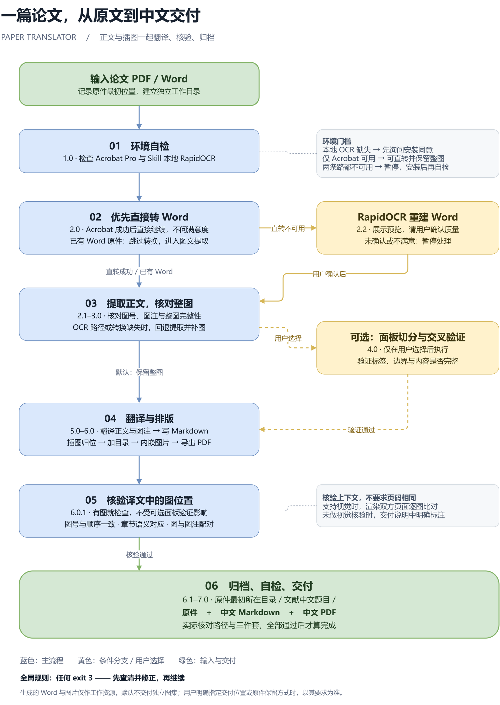

# paper-translator

> 一个 Claude Code Skill：把英文学术论文 PDF 从头到尾翻成中文——**图和正文一起交到你手上**，Markdown 和 PDF 各给一份。

**English**: A Claude Code skill that translates English academic papers into Chinese. It pulls out the *figures* along with the text, double-checks that none of them quietly went missing, and renders the result to both Markdown and PDF — no LaTeX needed.

---

## 流程概览



> 2026-10-05 更新：流程图改为纵向主线，右侧展示 OCR 回退和可选面板验证；补齐 Word 原件入口、图位置核验与最终归档三件套。

蓝色是主流程，黄色是条件分支或用户选择，绿色是输入与交付；右侧虚线表示可选的面板验证路径。**OCR 重建出来的 Word 好不好，得用户亲口确认；Acrobat 顺利直转的，不拿满意度去打扰人。** 任何一处冒出 `exit 3`，没查清楚之前别往下走。

**第一条命令永远是环境自检（1.0）**，能力只看两样：Acrobat Pro，和 Skill 自带的本地 RapidOCR。
从 2026-09-15 起，OCR 程序和依赖固定住在真实 Skill 目录的 `ocr/.venv` 里，模型放在 `ocr/models`。
全局 Python 或别的项目里装的 OCR 一概不认。缺了就先问用户同不同意下载到本 Skill；两条路都走不通、用户又拒绝或者没回话，就到此为止。

主干一句话：**记下原件在哪 → 检查环境 → Acrobat 直转或 RapidOCR 识别 → 核对正文和插图 → 翻译 → 排版并自检 → 核验译文里的图还在不在原文的位置 → 把原件 + Markdown + 译文 PDF 归档并核验 → 交付文件夹**。图里只画了主干，具体命令看下文和 `SKILL.md`。顺带澄清一个容易混的点：图片交叉验证和保存图集是两码事——不存图集，不代表译文里不放图。

**交付位置固定是 `原件最初所在目录 / 文献中文题目 /`**，除非当前用户明确说要放别处。`D:\codex\outputs` 那个通用默认路径在这里不适用，工作副本所在的目录也不能冒充原件位置。默认会把原件移进去，文件名不变；另外两份分别叫 `<原文标题> 中文翻译.md` 和 `<原文标题> 中文翻译.pdf`。注意转 PDF 那一步只管转换、不管归档——它跑成功之后，还得按 `SKILL.md` 的 6.1 和 7.0 走完，亲手核对三件套和路径，才算真的完事。碰上重名冲突、续跑、移动失败这些情况，一律以 `SKILL.md` 开头的「交付路径契约」和 6.1 为准。

> 图的源文件是 [docs/pipeline.drawio](docs/pipeline.drawio)，拿 draw.io 打开就能改。

---

> ### 🫠 先自曝一下
>
> **这是个纯 vibe coding 产物。** 需求是我提的，坑是我踩的，代码基本是 Claude 写的——我本人是编程小白，里面的正则我也看不太懂。所以别拿工程规范来要求它，能解决问题就行。
>
> **我不维护，也不处理 issue。** 用着不顺手就直接 fork，改成你喜欢的样子；代码是 MIT 协议，随便改随便发。
>
> 不过该测的都测过了，不是随手生成完就往上一扔：
> - 两篇真实期刊论文全流程跑通（Nature Commun. 24 页、Diamond & Related Materials 8 页双栏）
> - 故意制造漏图场景，确认告警真的会拦下来（而不是摆设）
> - 矢量图表、正文内嵌图这两种边缘场景，各自构造 PDF 验证过
> - Acrobat 自动导出：两种 layout 模式各导一遍做结构对比；崩溃后恢复注册表的那条路径，单独造了场景验证
>
> 开发过程中还顺手测出几个真 bug，都修掉了：图注被转换器粘进正文时，之后所有图的编号会整体错位一号；「一条图注都没抽到」曾经被静默判为通过；Windows 下中文路径和编码引发了好几处静默失败。**没测过就不敢说能用**——这条底线好歹守住了。
>
> 后来又拿两篇真论文（Small 2024 单栏、Adv. Funct. Mater. 2026 十九页双栏综述）跑了一遍全流程，当场又揪出两个同类的静默失败，都已修好：
> - **负责图归位的那一步把「零张图」判成了成功。** 译文文件名带圆括号（`Small (2024)`）时，`` 的路径匹配碰到路径里那个 `)` 就停了，整行不再被当成图片行 → 收集到 0 个图块 → 报告为空 → 打印「每张图都归位了」，而实际上六张图一张都没动。现在遇到这种情况会 exit 3，并直接点出是圆括号惹的祸
> - **宽横幅 logo 钻了尺寸判据的空子。** 原先只按「远小于中位数」来滤掉页面装饰，而 Wiley 那篇的 `ADVANCED SCIENCE NEWS` 横幅是 2933×676——全篇**最大**的一张图，于是它抢走了图 1 的位置，后面每张图都错位一号。现在加了形状判据：第一条图注之前、长宽比 ≥ 3 的一律判为装饰（阈值取自 18 张真图的实测，最扁的一张是 2.33）

---

> ### 🚨 装完先跑这两行，不然命令要么报「找不到文件」，要么刷出一串 MISSING
>
> **第一行：`$SK` —— 脚本到底在哪。** `SKILL.md` 里所有命令都通过 `$SK` 调用，默认值是 `~/.claude/skills/paper-translator`。**前提是那儿真的有脚本文件。**
>
> ```bash
> SK=~/.claude/skills/paper-translator
> ls "$SK"/*.py >/dev/null 2>&1 || echo "SK 不对：这个目录里没有脚本"
> ```
>
> 要是打印出了那句提示，说明你的装法把**本体放到了别处**，`~/.claude/skills/paper-translator/` 下只剩一个用来注册 `/paper-translator` 命令的 `SKILL.md`（桩文件）。常见的几种情形：
>
> - 为了不占系统盘，本体放在别的盘（如 `D:\...\skills\paper-translator`），`~/.claude/skills/` 下只留个桩
> - 用 symlink / junction 指了过去
> - 走插件方式安装，实际落在了 `~/.claude/plugins/` 下
>
> **改法很简单：把 `$SK` 换成真正放着脚本的那个目录**，其余命令一个字都不用动。桩文件正文里一般会写明真实路径。
>
> 用桩方案的话，改了 `description` 要重新生成桩，不然模型读到的还是旧描述——详见下文「触发方式」。
>
> 按下文「安装」直接 `git clone` 到 `~/.claude/skills/paper-translator` 的标准装法不受影响，那行检查会悄无声息地通过。
>
> **第二行：`$PY` —— 解释器固定用 Skill 里的那个。** 在 Codex 这台机器上，真实目录是
> `D:\skills\paper-translator`；C 盘那个注册入口里既没有脚本，也没有 OCR。
>
> ```powershell
> $SK = 'D:\skills\paper-translator'
> $PY = Join-Path $SK 'ocr\.venv\Scripts\python.exe'
> if (-not (Test-Path -LiteralPath $PY)) { $PY = 'python' }
> & $PY "$SK\<自检脚本名>.py" --json
> ```
>
> macOS / Linux 用 `PY="$SK/ocr/.venv/bin/python"`；还没装的时候，系统 Python 只拿来跑自检或安装器。
> **不会再去扫别的解释器，也不会因为全局装过，就当本 Skill 已经就绪。**
>
> 自检和四个 OCR 命令行入口会自动切到已经存在的本地解释器，其他脚本用报告里给出的
> `interpreter`。要盯的是 `probes.ocr.ok`，以及 `ocr_root`、`ocr_python`、`ocr_models` 这三项；
> 自检退出码是 0，可能只说明 Acrobat 能用。光有一个空的 `ocr/` 文件夹，是过不了自检的。

---

> ### ⚠️ 使用前提，务必先读
>
> ---
>
> ## 1. Acrobat Pro、RapidOCR 至少得有一样能用
>
> ---
>
> **两样都没有就停下，先问用户同不同意下载、安装 RapidOCR。**
>
> 装完先跑一下自检，它会当场告诉你这台机器到底能干什么（`<自检脚本>` 就是第一章「环境自检」里那一个）：
>
> ```bash
> "$PY" "$SK"/<自检脚本名>.py
> "$PY" "$SK"/<自检脚本名>.py --json
> ```
>
> 两条路径各管一摊：
>
> | 能力 | 有了它 | 没有它 |
> |---|---|---|
> | **Acrobat Pro**（Windows） | 直接把 PDF 转成 Word；成功了就不问满意度 | 回退到 RapidOCR 重建 Word |
> | **[RapidOCR](https://github.com/RapidAI/RapidOCR)** | 识别后重建可编辑的 Word，这时必须问满意度；还能拿来验证面板标签 | Acrobat 照样能直转，但标签交叉验证得先把 RapidOCR 补上 |
>
> **能过 OCR 门禁的，只有本 Skill 里的 RapidOCR。** Word 也好、全局安装也好，都不算数；本地 OCR 用不了时，
> 先征得用户同意，再把 RapidOCR、依赖和模型下载或修复到 `<真实 Skill 目录>/ocr`。
> 两条路径都不可用、又没拿到同意，就不许安装、不许继续；没有任何绕过参数。
>
> **用户点头之后**，统一用本地安装器：
>
> ```powershell
> python "$SK\<OCR 安装器名>.py" --install
> if ($LASTEXITCODE -ne 0) { throw 'OCR 安装失败' }
> $PY = Join-Path $SK 'ocr\.venv\Scripts\python.exe'
> & $PY "$SK\<环境自检名>.py" --json
> ```
>
> 安装器会建一个隔离环境、装好依赖、复用已有的默认模型，缺的模型再下载到 `ocr/models`。
> 不带 `--install` 就不装。自检本身不下载任何东西，也不启动 OCR 引擎；它只核对本地包的来源、
> 依赖能不能导入，以及默认模型的 SHA256。全局已经装好的东西原样保留，不会被移走或卸载。
>
> ---
>
> **2. 这是辅助工具，不是质检工具**
>
> 脚本能打包票的只有三件事：图没漏、图注没错位、章节没缺。**翻得好不好，全看你用的模型**——术语、专业表述、公式转写都可能出错，而且错得很自然，一眼不太看得出来。
>
> OCR 也一样：识别率再高也会错，公式、上下标、特殊符号尤其容易栽跟头。
>
> 拿去做学术用途的话，请务必对着原文人工复核，**数据、单位、结论性的表述**更要盯紧。别把机翻结果直接拿去投稿、引用，或者转述给别人。

---

## 为什么需要它

### 坑一：图会悄无声息地消失

让 AI 翻论文 PDF，最常见的翻车不是翻错，而是**图没了**。

提取 PDF 文本层是一种「安静的成功」：不报错、不缺页、正文一字不落，可图一张都不在。你拿到一份读着通顺、看着完整的译文，直到某一刻发现「如图 3 所示」后面什么都没有。

论文里的图有三种长法，**纯文本提取一种都拿不到**：

| 形态 | 为什么会漏 |
|---|---|
| 独立整页图（图注在正文，图在末尾整页） | 这页文字量≈0，但整篇不是扫描件，「扫描件检测」直接放行 |
| 正文页内嵌图 | 这页文字量正常，任何指标都看不出异常 |
| 矢量绘制的图表 | `get_images()` 返回 0 张，栅格图检测彻底失灵 |

这个 skill 三种都查，还会做**图数量交叉校验**：正文引用了 Fig. 1–4，就必须产出 4 张图；数目对不上就以退出码 3 直接中止，绝不在漏图的状态下开工翻译。

> 这个项目就是被一次真实事故逼出来的：一篇 24 页的期刊论文，正文 20 页有文本层，图 1–4 单独占了最后 4 页。文本提取一切正常，译文也交了，结果图一张没有。

### 坑二：傻福外刊非要把一页劈成左右两半 😠

先把结论摆这儿：**双栏是一坨纯粹的历史包袱，一个除了排版惯例自己、谁都不受益的祖宗仪式。**

它当年不是没道理——铅字时代行短一点眼睛少跑、双面印省纸、订起来薄。问题是那套前提早死透了：几乎没人再从图书馆抱纸质合订本回来，绝大多数人是在 13 寸笔记本或 iPad 上看 PDF。可这帮外刊一条都不肯松手，硬把一份为「纸」设计的版式，塞给一个没人打印的世界。

于是流程变成这样：作者交动辄四位数美元的版面费，照它的模板一格一格排整齐，读者最后拿到的是什么？一份缩到整页可见就一个字看不清、放大到能看清一栏就得横向来回拖、读完左栏还得滚回页顶重来一遍的 PDF。**一页要翻两趟。** 就为了供着那条谁也不敢动的中缝。现在很多刊确实也给 HTML 版，但能离线存下来、能标注、能拖进阅读器的，往往还是那份双栏 PDF——所以这份包袱谁也躲不开。😤

它的格式洁癖全花在中缝对不对得齐上，从来没花在「这东西能不能被读」上。**被伺候的是一台早就不在场的印刷机，被牺牲的是每一个活人读者。**

对机器更是灾难，而这里才是真正离谱的地方：**PDF 里根本没有「栏」这个东西。** 文件里只有一堆带坐标的字符，「哪些字属于左栏」全靠转换器按 x 坐标现场猜。人眼看着天经地义的那条中缝，在文件里压根儿不存在。猜错了还不会报错——它只会安静地把两栏交叉拼起来递给你：

| 你以为 | 实际可能发生 |
|---|---|
| 读完左栏再读右栏 | 左栏一行 + 右栏一行交替拼接，句子互相嵌套 |
| 段落是完整的 | 段落断在句子中间（实测某篇双栏论文约 **20%**） |
| 词不会被切开 | `ScienceDirec` 和 `t` 成了两个独立文本框 |
| 一段就是一段 | 双栏正文被打散进 **58 个文本框** |

后三行是此前 PDF 导入实验在单篇论文上的实测数字，换论文、换转换器都会变，但**方向是一致的**。Acrobat 的「Retain Page Layout」模式同样中招：它忠实还原视觉位置，代价是句子顺序跨块错乱，实测同一句被搅成过这样：

```
weakly allowed due to ┆ transitions22,23. Notably, ┆ orbital angular momentum mixing
```

扫描件更是重灾区：OCR 按整行横扫，一行同时压到左右两栏时，左栏的半句和右栏的半句**可能**被读成同一句。这一层本项目不解决——OCR 返回什么顺序就是什么顺序。

这些错法有个共同点，也是最阴的地方：**它们在 Markdown 里肉眼看全都正常。** 词被切开、两栏拼错、段落断在句中，喂给翻译模型后**可能**产出语法通顺、排版体面、读起来很像样的错译——你不逐句对着原文看，根本抓不出来。一个为了「看起来专业」而存在的排版，最后的产物是看起来专业的胡话，挺配的。所以本项目宁可在翻译开始之前 exit 3 直接罢工，也不生产这种东西。

**所以这个 skill 的输出是单栏的。** 一栏到底、图嵌在正文原位、图注老老实实跟在图下面、「如图 3 所示」下一屏就是图 3——就是毕设论文那种排版，人能一路读下去的那种。想在手机上读、想丢进 Word 接着改、想直接打印，都行。中缝没了，没人会怀念它。

---

## 首选路径（2.0）：先把 PDF 转成 Word

**这是默认的第一步。** 能用 Acrobat 就先让它把 PDF 直接转成 Word，图文位置尽量保住；Acrobat 用不了或者转失败了，才改用 RapidOCR 识别并重建 Word。OCR 的结果要等用户确认，之后再从原 PDF 把插图补齐。

> Word 文档只是脚手架，**不是交付物**。最终交的是 Markdown + PDF；图片先放在任务工作目录里，到 5.4 再嵌进 Markdown。**不问要不要保存图片合集，默认不存、也不交付独立图集。**

**Acrobat Pro 导出全程自动**，质量也最好。唯一要人动手的，是**首次运行时批准一次 UAC**（把受信任脚本写进 Acrobat 安装目录）；批准一次永久有效，之后再没有任何交互：

```powershell
& $PY "$SK"/<文件名>.py <pdf> -o <work>/source.docx  # Acrobat -> RapidOCR
& $PY "$SK"/<文件名>.py --check                # 看本机准备好了没
& $PY "$SK"/<文件名>.py --install-acrobat-js   # 单独装受信任脚本
```

**导出要选「Retain Flowing Text」，别选「Retain Page Layout」**（脚本默认就是前者，`--layout page` 可以切过去）。这一点跟直觉是反着的：Page Layout 会把每一块按视觉位置钉死，正文被拆成上百个文本框、每段还写两遍（DrawingML + VML），**句子顺序也会跨块乱掉**——实测同一句被搅成「weakly allowed due to ┆ transitions22,23. Notably, ┆ orbital angular momentum mixing」，拿这种东西去翻译，大概率要出错。Flowing Text 能保住阅读顺序、标题层级和分段，图也照样嵌在正文原位。

**自动化是怎么打通的**：这条路之前被判过「不可能」，其实是三个互不相干的故障，恰好共用了同一句误导人的 COM 报错「尚未实现」(E_NOTIMPL)：

| 坑 | 症状 | 处理 |
|---|---|---|
| pywin32 调用约定 | **任何** JSObject 方法都报 E_NOTIMPL，连非特权的 `getPageNumWords()` 都报 | 用纯 `DISPATCH_METHOD` 调用（pywin32 默认会附带 `DISPATCH_PROPERTYGET`，Acrobat 不接受这个组合） |
| folder 脚本位置 | 脚本明明装了，却调不到 | Acrobat 25.x 只读**应用级**的 `<安装目录>\Javascripts\`，用户级 `%APPDATA%` 那个完全不理；写应用级目录要提权，所以要走一次 UAC |
| Protected Mode | `saveAs` **静默挂死**——不报错、不超时、也不弹对话框 | 导出期间临时关掉沙箱，结束后写回原值 |

第一条最坑人：它看起来像是权限被拒，其实跟权限模型毫无关系。

> ⚠️ **它会动注册表**：导出期间把 `HKCU\...\Adobe Acrobat\DC\Privileged\bProtectedMode` 置 0，结束后写回；原值同时存一份到临时文件，哪怕进程被强杀，下次运行时也能补上恢复。不想让它碰沙箱设置，就用 `--engine rapidocr`。
>
> **别用管理员身份运行 Acrobat 或本脚本**——需要提权的只有那一次文件复制；提权进程和普通进程之间的 COM 连接，会被 Windows 的完整性级别隔离拦掉。

实测环境：Acrobat Pro 25.1（Exchange-Pro）+ pywin32 311 + Windows 11。用户拒绝 UAC、没装 Acrobat Pro（Reader 不行）、或者压根不在 Windows 上时，默认回退 RapidOCR；RapidOCR 也缺的话，就停下来请求安装同意。

**转换引擎只有 Acrobat 和 RapidOCR 两个，不调用 Microsoft Word。** Word/DOCX 在这里只是个中间格式。RapidOCR 重建的结果里既有可编辑的识别文本，也内嵌了原页预览，方便用户对照着核对；它不声称还原了原文版式，也不会把整页预览当成论文插图拿去配号。

### 决策点（2.2）：看实际走了哪条路，再决定问不问

转换成功后，读同名 `.conversion.json` 里的 `engine` 和 `requires_word_review` 来判断，不能光凭「这台机器装了 Acrobat」就下结论。

| 实际结果 | 走哪条路 |
|---|---|
| **Acrobat 直转成功** | 不问 Word 满意度；自动检查图文后直接往下走，有告警就自己修、修完再测 |
| **RapidOCR 重建 Word** | 把 Word、识别片段和统计摆给用户看，必须问满意度，并等到回答 |
| **OCR Word 满意** | 用这份认可过的正文，到 3.0 从原 PDF 补齐插图，然后继续 |
| **OCR Word 不满意** | 调整识别或修正结果，重新生成 Word 再问一次；这一步确认不能跳 |

碰到多面板图，要不要做图片交叉验证仍然单独问用户。Acrobat 路径只问这一个问题，不捎带满意度。无论走哪条路径，都不问要不要保存图集。

---

## 依赖

装完先跑一次环境自检（1.0），它会把下面这张表在你机器上的真实状态打出来，跑不动的组合当场拦下。

| 用途 | 依赖 | 安装 | 必需性 |
|---|---|---|---|
| PDF 解析与渲染 | PyMuPDF | `"$PY" -m pip install pymupdf` | **硬性**，没它什么都读不了 |
| 读 Word 文档（首选路径） | lxml | `"$PY" -m pip install lxml` | 走 Word 路径就得有 |
| OCR 重建 Word | python-docx | `"$PY" -m pip install python-docx` | RapidOCR 路径必需 |
| OCR 重建与面板切分 | Pillow + NumPy | `"$PY" -m pip install pillow numpy` | RapidOCR 重建或图片交叉验证要用 |
| Acrobat Pro 转换（Windows） | Acrobat Pro + pywin32 | `"$PY" -m pip install pywin32`（Acrobat 需另行安装授权） | **两条能力路径之一** |
| 扫描件 OCR / 面板标签校验 | **[RapidOCR](https://github.com/RapidAI/RapidOCR)** 及运行依赖 | 见前文安装命令 | **两条能力路径之一** |
| Markdown → HTML | pandoc ≥ 3.0 | [pandoc.org/installing](https://pandoc.org/installing.html) | 只影响 PDF 输出 |
| HTML → PDF | Chrome 或 Edge | 大多数系统自带 | 只影响 PDF 输出 |

两条能力路径至少得有一条能用，否则环境自检（1.0）exit 4。这时必须先征得用户同意安装 RapidOCR，不同意就停；哪怕是文字版 PDF 也绕不过去。

**OCR 只认本 Skill 里的 [RapidOCR](https://github.com/RapidAI/RapidOCR)。**

- 扫描页重建、正文识别、面板标签校验、诊断命令，调用的都只有 RapidOCR，
  不存在自动切换到别的引擎、或者留个兼容入口这回事。
- 默认模型是 ONNX 格式的 PP-OCRv6 small 检测模型、识别模型和方向分类模型，
  放在 `ocr/models`；自检会核对本地依赖的来源，以及这三个模型的 SHA256。
- 先征得用户同意，再跑本地 OCR 安装器（`<真实 Skill 目录>` 下的那个安装脚本）。依赖装进 `ocr/.venv`，
  不碰全局 Python；本地环境里只装一种 OpenCV。
- RapidOCR 缺失、损坏或初始化失败时，OCR 就此停下，并报出本地修复命令。
  不能换个环境接着跑；诊断命令初始化失败会返回非零退出码。
- 提取扫描件时加 `--ocr`，识别来源会记为 `ocr_backend=RapidOCR`。
  想单独诊断一张图：`"$PY" "$SK/<OCR 诊断脚本名>.py" <图片>`。
- 已验证的版本组合：`rapidocr 3.9.2` + `onnxruntime 1.26.0` + Python 3.13。

**不需要 LaTeX**。如果只翻译、不导出 PDF，pandoc 和浏览器都可以不装。

---

## 安装

Skill 的目录结构跟仓库根目录一模一样，直接 clone 到 skills 目录就行：

**macOS / Linux**

```bash
git clone https://github.com/obenic/paper-translator.git \
  ~/.claude/skills/paper-translator

SK=~/.claude/skills/paper-translator
ls "$SK"/*.py || exit 1          # 先确认脚本真在这儿
# 必须先取得用户下载并安装 OCR 的同意：
python3 "$SK/<OCR 安装器名>.py" --install || exit 1
PY="$SK/ocr/.venv/bin/python"
"$PY" "$SK/<环境自检名>.py" --json
```

**Windows (PowerShell)**

```powershell
$SK = 'D:\skills\paper-translator'  # 放着脚本的真实目录，不是 Slash 注册入口
ls "$SK\*.py"                      # 先确认脚本真在这儿
# 先征得用户同意下载到此 Skill，再执行：
python "$SK\<OCR 安装器名>.py" --install
if ($LASTEXITCODE -ne 0) { throw 'OCR 安装失败' }
$PY = Join-Path $SK 'ocr\.venv\Scripts\python.exe'
& $PY "$SK\<环境自检名>.py" --json
```

> 上面两处 `<...名>` 是占位符，替换成 `ls` 列出来的对应文件即可（一个是本地 OCR 安装器，一个是环境自检）。本文其余命令同理，统一写成 `"$PY" "$SK"/<文件名>.py`。

装在 `~/.claude/skills/` 下是**全局生效**（在哪个目录都能用）；只想在某个项目里用，就放到那个项目的 `.claude/skills/` 下——**这种装法记得按顶部的警告，把 `$SK` 改成该项目里的实际路径**。

**最后那次自检别省。** 确认 `probes.ocr.ok=true`，并且报告里的解释器、
程序和模型路径全都在真实 Skill 目录内。`ocr/` 不进 Git，所以更新脚本不会把你本机的依赖或权重传上去。
换了机器、或者挪了 Skill 的位置，就得重建虚拟环境——虚拟环境不是便携软件，不能直接复制过去接着用。

装好后新开一个 Claude Code 会话，说一句「翻译这篇文献」就行。

---

## 使用

把 PDF 的路径丢给 Claude 就行：

```
翻译桌面上的 example-paper.pdf
```

流程：**1.0 环境自检** → 2.0 转 Word → 2.1 提取或预览 → **2.2 Acrobat 直转不问满意度，OCR 重建必须问；多面板图另选交叉验证** → 3.0/4.0 → 5.0 分批翻译 → 5.1 写 Markdown → 5.2 图归位 → 5.3 加目录 → 5.4 图片内嵌 → 6.0 转 PDF → **6.0.1 图位置核验** → 6.1 归档 → 7.0 自检。默认不保存独立图集。

产物都收在原 PDF 旁边一个用中文题目命名的文件夹里，原件也一起挪进去（6.1）：

```
<原 PDF 所在目录>\<中文题目>\
├── <原文文件名>.pdf          # 原件，移动进来，外面不再留
├── <原文标题> 中文翻译.md      # 图片已内嵌；开头带一个可刷新的「目录」块
└── <原文标题> 中文翻译.pdf     # 图片已内嵌，可单独发送；标题页下方是目录页，侧边栏有书签树
```

不放图集：图已经嵌在 md 和 PDF 里，位置也跟原文对得上。转换过程中生成的 `.docx`、`_docx/`、`media/`、`panels/`、`_figs/`、`.bak` 这些脚手架都不进交付文件夹，归档确认之后按 `SKILL.md` 6.1 的清理规则处理；但如果 `.docx` 是用户自己提供的原件，就必须保留并归档，不能当脚手架删掉。

### 翻译规范

- 全文翻译，一段不跳（摘要、引言、结果、讨论、方法、作者贡献、**图注**）
- **参考文献、致谢、CRediT、利益冲突声明保留英文原文**，不翻译
- **图注一定要翻**——复杂图的图注能有几百字，是读懂这张图的唯一入口
- 图注里的面板标记（**a** / **(a)**）和图号原样保留，只译描述文字
- **图片本身不动**：图里的英文标注保持原样，不做 OCR 重排
- 术语第一次出现时附上原文：系间窜越（intersystem crossing, ISC）
- 化学式、单位、数值、公式编号、图表编号原样保留
- 公式用 Unicode 符号书写，不用 LaTeX
- 人名、期刊名、仪器型号保留英文

---

## 触发方式

要不要调用 Skill，是模型读 `description` 来判断的。`description` 里已经写进了具体的触发短语，覆盖「翻译 / 译成 / 译为 / 翻成 / 中译 / translate」×「文献 / 论文 / 期刊 / 全文 / 摘要 / PDF / paper / article / literature / manuscript」这些说法：

| 会触发 | 不会触发 |
|---|---|
| 翻译这篇文献 | 翻译这段代码注释 |
| 把这个 PDF 翻译成中文 | 这篇 paper 讲了什么 |
| translate this paper | 总结一下这篇论文 |
| 把期刊全文译为中文 | 把变量名翻译成英文 |

> 改了 `description` 之后，如果用的是桩方案，记得重新生成桩，不然模型看到的还是旧描述。

---

## 各步骤详解

每一步都是一个能脱离 Claude、单独当命令行工具使的脚本。下面按流程顺序讲每步干什么、怎么判成败。

> 命令里统一用 `"$PY" "$SK"/<文件名>.py` 的形式。`<文件名>` 指真实 Skill 目录下负责这一步的那个脚本，`SKILL.md` 的流程表里对每一步都写明了是哪一个；手动跑的时候 `ls "$SK"` 看一眼就知道。

### 环境自检（1.0，第一个跑的）

```bash
"$PY" "$SK"/<文件名>.py                 # 报告 + 判定
"$PY" "$SK"/<文件名>.py --json          # 机器可读
```

能力只检测 Acrobat Pro 和 RapidOCR；另外会查 PyMuPDF、lxml、python-docx、Pillow、NumPy、pandoc、Chrome/Edge 等依赖，并打印**当前用的是哪个解释器**。它不启动应用、不装软件；实际导出和 OCR 能不能成，还得靠后面的命令来验证。

| 退出码 | 含义 |
|---|---|
| `0` | Acrobat Pro 或 RapidOCR 至少有一项能用 |
| `1` | 缺 PyMuPDF，什么都读不了 |
| `4` | **两条路径都用不了**；必须请求用户同意安装 RapidOCR，不同意就停 |

判定里有一条不太显而易见：**转换器装了、但没装 lxml，不算可用能力**——抽取正文那一步要靠 lxml 解析导出的 .docx，少了它，Word 路径会在下一步直接挂掉。这种情况下报告里照实显示 `ok`，但 verdict 里会标成 `UNUSABLE`。

### PDF 转 Word（2.0，首选路径）

```bash
"$PY" "$SK"/<文件名>.py <pdf> [-o out.docx] [--engine auto|acrobat|rapidocr]
                                  [--layout flowing|page]
"$PY" "$SK"/<文件名>.py --check                 # 看本机准备好了没
"$PY" "$SK"/<文件名>.py --install-acrobat-js    # 一次性安装 Acrobat 受信任脚本
```

`--engine auto` 先试 Acrobat，失败了只会回退到 RapidOCR。Acrobat 默认 `--layout flowing`；RapidOCR 可以用 `--ocr-lang`、`--dpi` 调识别效果。Acrobat 引擎只在 Windows 上能用；RapidOCR 不依赖 COM。成功后会写一个同名 `.conversion.json`，记下实际用了哪个引擎、需不需要确认满意度；输出文件已经存在的话，拒绝覆盖。

Acrobat 的 COM 导出跑在独立进程里，默认 180 秒超时，可以用 `--acrobat-timeout` 调。超时后只清理本次新开的 Acrobat 进程，恢复保护模式，再回退到 RapidOCR；接口返回了 `ok`、但输出没落盘或者 DOCX 无效，同样按失败处理。

| 退出码 | 含义 |
|---|---|
| `0` | DOCX 结构校验通过，转换来源报告也写好了 |
| `2` | 选中的转换器全失败了；把能力修好再重试，不许跳过门禁 |
| `1` | 出错 |

### 从 Word 抽正文 + 图 + 图的位置（2.1）

```bash
"$PY" "$SK"/<文件名>.py <docx> [-o OUTDIR]
```

产出 `content.md`（正文按顺序排好，图的位置用 `[[FIG 2 -> media/fig02.jpg]]` 标出来）、`content.json`、`media/`（图片按图号命名）和 `manifest.json`。

下面这几个坑会自动绕开：

| 坑 | 处理 |
|---|---|
| 每段文字都出现两遍 | Word 把文本框同时写成 DrawingML 和 VML 两份，跳过 `mc:Fallback` 子树即可 |
| 出版商 logo 被当成图 1、图 2，真图集体往后错位 | 两条判据一起上：**尺寸**滤掉小徽标（Elsevier logo 只有 248×271，真图都 ≥ 950），**形状**滤掉第一条图注之前、长宽比 ≥ 3 的宽横幅。第二条少不了——实测 Wiley 那张 `ADVANCED SCIENCE NEWS` 横幅 2933×676，是全篇最大的一张图，光靠尺寸挡不住它 |
| 图和它自己的图注在 XML 里隔得老远 | Word 会把浮动图锚在附近随便哪一段上，所以**按顺序给图和图注配对**，不按距离 |
| 某张图的图注被粘到了正文段落末尾 | 这个图号就从图注清单里消失了，按清单配号会让**后面所有图整体错位一号**（图 4 的图片被写成 fig05，还配上了图 5 的图注）。图注数和图数对不上时，改用正文里引用到的图号列表来配号 |
| 作者行、`Keywords:`、DOI、公式碎片被当成章节标题 | 标题读 DOCX 的 `Heading1..9` 样式，不靠「短、且不以句号结尾」去猜。实测一篇 7 页的 Elsevier 论文：靠猜得到 22 个标题（其中 12 个是垃圾，包括一句被截断的正文和四段公式碎片），靠样式得到 9 个，恰好就是真实章节。只有整篇一个标题样式都没有时，才退回按长度猜 |

对图做**三方交叉校验**——图注、图片、正文引用三者必须互相对得上，任何一条不符就 exit 3：一条图注都没抽到（这种情况以前会被静默判为通过）、有图注配不上图、正文引用的图号没有图注覆盖。

**exit 3 不代表编号错了。** 像图注被粘进正文那种情况，编号已经按正文引用自动修正了，但那条图注的文字还散在正文段落里，得你自己拼回来再翻。具体是哪一条不符，看 `manifest.json` 的 `problems` 数组。

参考文献 / 致谢 / 声明这类章节会被自动标上 `<!-- 不翻译 -->`。

### 可选：把整张图切成 a/b/c 单个面板并验证（4.0）

```bash
"$PY" "$SK"/<文件名>.py <figure.png> -o panels/ --layout 4,3,4,3,1 [--expect a-o]
"$PY" "$SK"/<文件名>.py <figure.png> -o panels/ --grid 2x2      # 强制均匀网格
"$PY" "$SK"/<文件名>.py <figure.png> -o panels/ --no-ocr        # 只用几何校验
```

**只有用户在 2.2 选了交叉验证，才会执行 4.0。** 用户跳过的话，就保留整张图、不生成 `panels/`，把整图放到正文第一次提到它的地方。`--layout` 是每行有几个面板，得自己看图数出来。不给也能跑（自动模式），但经常数错——数错了脚本会 exit 3 明说，不会装作成功。毕竟面板行与行之间的空隙可能只有 4 px，而面板*内部*（图和刻度标签之间）的空白反倒能有 30 px，光看像素根本分不清哪条才是边界。

**`--expect` 建议默认带上**：图注里列出的面板字母（`a-o` 或 `a,b,c`）就在抽出来的正文里，抄一遍就多一重保险。

RapidOCR 只负责校验标签和命名，不负责切分；切分靠的是布局、几何规则和图注清单三者配合。任何一项检查不过都会 exit 3；图注清单那项校验要传了 `--expect` 才做：

| 校验 | 抓的是什么 | 何时生效 |
|---|---|---|
| 标签一致性 | OCR 读到的 `a`/`b`/`c`，必须落在按阅读顺序被命名为同一个字母的那张图里 | 总是（除 `--no-ocr`） |
| 边框留白 | 每张图四周都得是背景色；有墨压着边 = 内容被切断了 | 总是 |
| 墨量守恒 | 所有面板加起来要覆盖整图约 100% 的墨，少了 = 丢了色标或图例 | 总是 |
| 文字守恒 | 每个 OCR 文本框里的**墨**都得落进某一张面板。看的是墨、不是矩形——检测框自带留白，而面板标签和坐标轴标题天生就贴着裁剪边，按矩形判的话，在 4 张真实图上会误报 7 次（每一次那些墨其实都 100% 在某张面板里） | 总是（除 `--no-ocr`） |
| 图注清单 | 图注声称的面板数必须等于切出来的张数——这是**唯一不靠图像本身的证人**，前四项看的都是同一张图 | 仅传了 `--expect` 时 |
| 上一面板的文字 | 某张裁剪框里出现了位于**它自己标签上方**的文字。面板标号在左上角，自己的内容不可能跑到标签上面去——那只能是上一行的坐标轴标题被留在了这儿 | 总是（除 `--no-ocr`） |

OCR 读不出 `i`、`l`、`o` 是常事（笔画太细），脚本会在 note 里说明，并用其余标签的一致性替它们作保——这不算失败。

没有 RapidOCR 时，`--no-ocr` 只能做几何和墨量方面的辅助检查，称不上“图片交叉验证”。

### 把图挪到正文第一次提到它的位置（5.2）

```bash
"$PY" "$SK"/<文件名>.py <译文.md> [--dry-run] [-o out.md]
```

图要是全堆在文末的 `## 图` 里，读者在第 4 页读到「如图 2 所示」，就得翻到第 12 页再翻回来。脚本会把图块整块搬出来，插到第一次提到该图号的那段正文后面，并核对搬动前后的图片数量，对不上就拒绝写入。原文件会留一份 `.bak`。

「补充图 2」不算提到图 2，会跳过。如果提及那句后面紧跟着一个公式代码块，图就插在**公式后面**——一段以「按下式估计：」结尾的话和它下面的公式是一体的，中间硬塞一张图，就成了正文许诺给你一个公式、端上来的却是一条曲线。退出码 `3` = 有图在正文里压根找不到提及，必须去查。

**临时译文的路径别带圆括号。** 5.2 还得靠解析图片路径来认图号，所以 `Small (2024)` 要写成 `Small 2024`；等 5.4 成功后，最终 Markdown 里的图片会换成 `data:` 形式，就不再依赖这个路径了。

> 走 Word 首选路径时，图的位置已经由上一步（抽取正文那步）给出（比「首次提及」更准），这一步可以跳过；它主要是给回退提取路径（3.0）用的。

### 提取文本 + 图（3.0，回退路径）

```bash
"$PY" "$SK"/<文件名>.py <pdf> [-o OUTDIR] [--dpi 200] [--max-width 1600] [--pages 21-24] [--ocr] [--ocr-lang en] [--split-panels]
```

产出 `text.txt`、`figures/pNN.png` 和 `manifest.json`。

**参数说明：**

| 参数 | 作用 |
|---|---|
| `--ocr` | 扫描件用 [RapidOCR](https://github.com/RapidAI/RapidOCR) 提取文字；文字型 PDF 会自动忽略这个参数 |
| `--ocr-lang en` | OCR 语种：`en` / `ch`（中英混排）/ `japan` / `korean` 等，默认 `en` |
| `--pages 21-24` | 强制渲染指定页面（图数量告警时用） |
| `--dpi 200` | 渲染分辨率，扫描件识别率低就改成 `300` |
| `--max-width 1600` | 限制图片宽度（默认 1600px，用来控制文件大小） |

| 退出码 | 含义 |
|---|---|
| `0` | 图数量和正文引用对得上 |
| `3` | **图可能漏了**——查 `manifest.json` 的 `per_page`，再用 `--pages` 强制渲染 |
| `1` | 出错（比如缺 PyMuPDF、缺 RapidOCR，或者 OCR 一个字都没认出来） |
| `4` | 扫描件没开 OCR，确认 RapidOCR 可用后加 `--ocr` 重跑 |

输出示例：

```
pages       : 24  (text pages: 20)
figures     : 4 rendered -> ./figures
  p 21  figures/p21.png     1600x1533   787KB  (standalone figure page; raster image 98% of page)
  p 22  figures/p22.png     1600x1535  1192KB  (standalone figure page; raster image 93% of page)
  p 23  figures/p23.png     1600x1357  1620KB  (standalone figure page; raster image 98% of page)
  p 24  figures/p24.png     1600x1891  1988KB  (standalone figure page; raster image 94% of page)
referenced  : Fig [1, 2, 3, 4]
```

**扫描件示例（加 `--ocr`）：**

```
OCR: scanned PDF, reading 1 pages (lang=en; first run downloads models)...
  p  1: 336 chars
pages       : 1  (text pages: 1)
OCR         : RapidOCR (lang=en)
figures     : 1 rendered -> ./figures
referenced  : Fig [1]

OK: figure count consistent with text references.
```

留意最后两行：OCR 把文字认出来之后，**图数量交叉校验对扫描件也重新生效了**——没有文本层的时候，这个校验是做不了的。

### 给译文加「目录」块（5.3）

```bash
"$PY" "$SK"/<文件名>.py <译文.md> [--depth 3] [--include-figures] [--dry-run] [-o out.md]
"$PY" "$SK"/<文件名>.py <译文.md> --remove
```

一篇 24 页的译文，用纯文本编辑器打开是没有任何导航的。脚本会在第一个 `##` 章节前面插入一个用 HTML 注释圈起来的块：

```markdown
<!-- TOC -->
## 目录

- [摘要](#摘要)
- [1. 引言](#1-引言)
  - [1.1 研究背景](#11-研究背景)
<!-- /TOC -->
```

- **要在归位那步之后再跑**：归位会搬动图块、删掉空出来的 `## 图` 小节，先加目录的话，会留下一份对不上的旧目录
- 锚点按 github-slugger 规则计算（小写、去掉标点和符号、空格转 `-`、中文原样保留、重名加 `-1`），GitHub / VS Code 预览 / Obsidian 里都点得动
- **`### 图 N` 默认不列进去**——十几张图会把真正的章节淹没；想要就加 `--include-figures`
- 幂等：反复跑只会刷新那一块，不会叠加，也不会多出空行；`--remove` 之后能逐字节还原
- 写入用 LF，原文件留 `.bak`，跟归位那步一个做法
- 退出码 `3` = 一个 `##` 都没找到——正常的译文不该长这样，回头去查

> PDF 的目录由转 PDF 那步自己生成，所以它会先把这个块剥掉再渲染——不会出现两个目录同时在场的情况。

### 把图片内嵌进 Markdown（5.4）

```bash
"$PY" "$SK"/<文件名>.py <译文.md>
```

归位完成后再跑。脚本把本地的 `` 改写成 ``，正文位置和图注都保持原样，并留一份 `.bak`。成功之后，Markdown 就不再依赖同级的图片目录了；等确认这步和转 PDF 那步都成功，进入归档，再按那里的清理规则处理临时的 `panels/`、`_figs/`、`media/`，以及本次流程产生的 `.bak`。退出码 `3` 表示有图片缺失或者是远程图片，这种状态不能直接交付。

### Markdown 转 PDF（6.0）

```bash
"$PY" "$SK"/<文件名>.py <input.md> [-o out.pdf] [--font serif|sans] [--keep-html]
                                 [--no-toc] [--toc-depth 3]
```

pandoc → 自包含 HTML（图片转成 data URI）→ Chrome/Edge 无头打印。

**字体分工是定死的**（`--font sans` 只把正文里的中文换成黑体，其余不变）：

| 位置 | 中文 | 拉丁字母・数字・ASCII 标点 |
|---|---|---|
| 正文、图注 | 宋体（SimSun） | Times New Roman |
| 各级标题、题头 | **加粗黑体（SimHei）** | 加粗 Times New Roman |
| 公式代码块 | — | Consolas 等宽（求和上下限靠等宽对齐） |

实现上靠的是 Chrome 逐字符解析 `font-family`：拉丁字体排在最前，ASCII 字符全落到 Times 上，只有 CJK 码位才往后落到汉字字体。要是把汉字字体放前面，每个数字、每个括号都会拿到宋体自带的那套打字机味拉丁字形。

- **全角标点（），。「」只能来自汉字字体**——Times New Roman 没有全角字形，所以它们跟着中文走，这在排版上本来就是对的
- **SimHei 没有粗体字形**，只能靠 Chrome 合成加粗，PDF 里是逐字的 Type3，文件大约大 12%（实测 3.2 → 3.6 MB），文字照样能搜。想要真粗体，就把 `HEI` 的第一项换成 `"Microsoft YaHei"`
- Markdown 那份不带字体信息（纯文本，长什么样由阅读器决定），字体设置只对 PDF 起作用

**目录页和 PDF 书签默认都会生成**，不用额外加参数。这俩是两回事：

| | 是什么 | 能不能点 |
|---|---|---|
| 目录页 | 标题页下方那一页「目录」，由 pandoc `--toc` 生成 | **不能**。Chrome 不会把页内锚点转成 PDF 链接注释 |
| PDF 书签 | 阅读器侧边栏里的大纲树，由 Chrome `--generate-pdf-document-outline` 根据各级标题建出来 | 能，PDF 里真正负责跳转的是它 |

- 书签树**包含** `图 N` 标题（方便直接跳到图），目录页**不包含**（不然图注标题会把目录灌满）
- `--toc-depth 2` 只列到 `##`；`--no-toc` 两个一起关
- 最后会报出 `toc : N entries` 和 `outline : N bookmarks`；看到 `outline: NONE`，说明这个浏览器不认那个开关——目录页还在，但没有书签树

### 核验译文里的图还在不在原文那个位置（6.0.1）

```bash
"$PY" "$SK"/<文件名>.py <原文.pdf> --md <译文.md> [--pdf <译文.pdf>]
                                  [--render-dir <dir>] [--json]
```

归位那步把图搬到了正文第一次提到它的地方，**但搬完之后一直没人核对过搬对了没有**。它只拦得住「一张图压根没找到提及」；图落到了错误的章节下、图号对不上、先后顺序整体错乱，它一律静默放行。完成前自检里那条「图紧跟提到它的正文」纯靠人眼，背后没有任何脚本证据。这步就是来补这个缺口的。

判据是**上下文一致**，不是页码一致。译文重新排版之后页数必然变（中文比英文短、字体不同、图被重新归位），要求逐页对齐既不现实也没意义——真要做得把 6.0 那套排版整体重写成按页对齐。

**脚本判死的，模型判活的：**

| 谁 | 判什么 |
|---|---|
| 脚本 | 图号集合、先后顺序；对不上就退出码 `3` |
| 模型 | 对照表里每个图号，原文的章节和译文的章节是不是同一部分（`Results and Discussion` ↔ `结果与讨论`）|
| 模型（多模态）| 看 `--render-dir` 渲染出来的双方页面，逐图确认图和图注配对、图的内容没串位 |

因为原文是英文标题、译文是中文标题，字符串比对解决不了语义那一层，所以这张表是**打印出来给模型读的**，不是脚本自己下结论。

```
figure | source                                     | translation
-------+--------------------------------------------+-----------------------------------
  1    | p.2  2. Results and Discussion             | p.2  2. 结果与讨论
  2    | p.3  2. Results and Discussion             | p.3  2. 结果与讨论
  3    | p.4  3. Methods                            | p.4  3. 方法
```

页码只作参考，**要比的是章节那一列**。原文锚点取「图注所在的位置」而不是图片本身——期刊常把图注集中排一页、图放在后面几页，而图号和图所属的章节这些信息都在图注上（跟 2.1.1 的整图核验用的是同一套约定）。

| 退出码 | 含义 |
|---|---|
| `0` | 图号和顺序都对上了，接着读对照表判章节语义 |
| `3` | 有图缺失、多余或者串位——回去查 5.2 的归位结果，别继续 |
| `1` | 出错（文件不存在，或者 `--render-dir` 没配 `--pdf`）|

译文的页码显示成 `p.?`，说明没能定位到，看 `NOTE` 行给的原因：PDF 里的图片数跟脚本从 Markdown 里数出来的对不上时（`.md` 在 6.0 之后又改过，或者 PDF 是旧的），脚本就放弃按顺序映射，退回去搜图注文字。

**当前模型是不是多模态，看会话里声明的模型名。** 这个判断不可靠——走代理或者中转的时候，声明的名字跟真实后端可能对不上；拿不准就按非多模态处理。非多模态时脚本的硬判据和对照表照跑、语义比对照做，**只是少了视觉那一层**，这不是失败，但交付说明里得写明「未做视觉核验」，不能把降级说成已验证。

这一步**不替代 4.0 的面板交叉验证**，也不改变它的执行条件：4.0 管的是「一张图切得对不对」，只在 2.2 用户选了验证时才跑；这里管的是「图放的位置对不对」，有图就跑。

> 原需求是「在图片交叉验证那项加一步」，但 4.0 发生在翻译之前，那时候译文还不存在，没法对比——所以它才成了 6.0.1 这个独立步骤。

---

## 工作原理

找图时，每一页都取三个指标——文字量、栅格图面积占比、矢量绘制操作数——任意一条命中就渲染这一页：

```python
if 文字量 < 200 and (图面积占比 > 1% or 绘制操作数 >= 10):  # 独立整页图
if 图面积占比 >= 5%:                                        # 正文内嵌图
if 绘制操作数 >= 50:                                        # 矢量图表
```

交叉校验会扫描正文里的图号引用（`Fig. 3` / `Figure 3` / `Fig. 3 |`），排除 `Supplementary` 和 `Extended Data`（补充材料是单独的文件，正文引用了 SI 图 17，不代表正文里有 17 张图），然后取最大值作为预期图数。

Markdown 输出借助 pandoc 的 `implicit_figures`，把图和图注编译成一个 `<figure>` 原子块：

```markdown
### 图 1 | 标题

```

**图注必须写在 `![...]` 的方括号里。** 要是写成独立段落，分页时图片会被推到下一页顶部，紧挨着的却是下一张图的图注——读者看到的就成了「图 1 的图片 + 图 2 的图注」。这种错在 Markdown 里肉眼看完全正常，只有到了 PDF 里才露馅。

---

## 已知限制

- **翻译质量本项目不打包票**——脚本只管流程完整，译文对不对取决于模型，必须人工复核
- **Acrobat 自动导出只有 Windows 上才有**，而且得是 Acrobat Pro（Reader 不行）。导出期间它会临时关掉 Acrobat 的 Protected Mode，完事再写回原值；如果沙箱被组策略（`HKLM\...\FeatureLockDown`）锁住了，它不会去改组策略，而是改用 RapidOCR；RapidOCR 也没有的话，先请求安装同意
- **OCR 重建的 Word 可能走样**：公式、上下标、阅读顺序都得核对，必须问用户满不满意。Acrobat 直转成功就不问满意度，但图文完整性检查照做
- **不规则版式切不了面板**：`--layout` 只能表达「每行几个」。要是某个面板跨了两行（比如 a 在左上、b 在右侧跨行、c 在左下），就退回整张图
- **上一面板的坐标轴标题和下一面板的标签挤在同一条水平带里时，这张图切不了**：横切线切在标题上面，标题就归了下一面板；切在标题下面，下一面板的标签又归了上一面板。校验会点名（"holds [...] above its own label"），处理办法是退回整张图。双栏期刊的窄图尤其常见——实测一篇 7 页 Elsevier 论文的 6 张图里，有 3 张是这样
- **面板贴得太紧会轻微串边**：并排的 SHAP force plot 之间没有空白，切点只能靠最小墨量去猜，邻图的轴标题可能蹭进来；校验会把它报出来
- **图注抓取率不是 100%**：实测两篇论文分别是 5/6 和 3/4。转换器常把某条图注粘到正文段落末尾——这时编号已经按正文引用自动修正，但图注文字得你自己从正文里拼回来（脚本会 exit 3 点名是哪一条）
- **OCR 会认错字**——公式、上下标、希腊字母、特殊符号尤其容易错，扫描件的译文更要逐句核对
- **Acrobat Pro 和 RapidOCR 都用不了时必须停下**：先请求用户同意下载、安装 RapidOCR，不同意就不许安装、也不许继续；文字版 PDF 也不能绕过
- **不保存独立图集**：不会问要不要存图片合集，图片只作为工作资源，以及 Markdown/PDF 里的内嵌内容来用
- 交叉校验是启发式的：一页可能有好几张图，一张图也可能跨页，所以数量对不上时是**提醒你复查**，不是断定出错
- **字体依赖系统里已经装的字体**：宋体/黑体用 SimSun/SimHei（Windows 自带），macOS 用 Songti SC / Heiti SC，Linux 需要思源或 Noto CJK；都没有就回退到系统默认，中文可能换成另一种字形。拉丁部分要 Times New Roman，缺了就回退到 Liberation Serif
- **PDF 目录页点不了**：Chrome 的 print-to-PDF 不会把 `<a href="#...">` 转成 PDF 链接注释（实测 kind==1 的链接是 0 个）。所以 PDF 里的跳转靠侧边栏书签树，目录页只是一份印出来的清单。想要能点的目录，就得换 LaTeX / Prince 这类排版后端——那就得装 LaTeX，跟本项目「不需要 LaTeX」的前提冲突
- **md 目录的锚点按 github-slugger 规则计算**，GitHub / VS Code / Obsidian 通用；换成用别的 slug 规则的渲染器（部分静态站点生成器），可能就点不动了
- 转 Word 那步的 Acrobat 引擎依赖 Windows COM；RapidOCR 重建和其余步骤都跨平台
- 主要在 Windows 11 + Python 3.13 上验证过；macOS / Linux 的路径已经适配，但没在真机上测过

---

## 版权提示

翻译别人的论文，产出的是**演绎作品**。很多开放获取论文用的是 CC BY-NC-ND 协议，其中的 **ND（禁止演绎）** 条款明确不允许公开分发译本。自己读、自己学没问题；要公开发布译文，请先确认原文的许可条款。

---

## License

MIT — 见 [LICENSE](LICENSE)。
